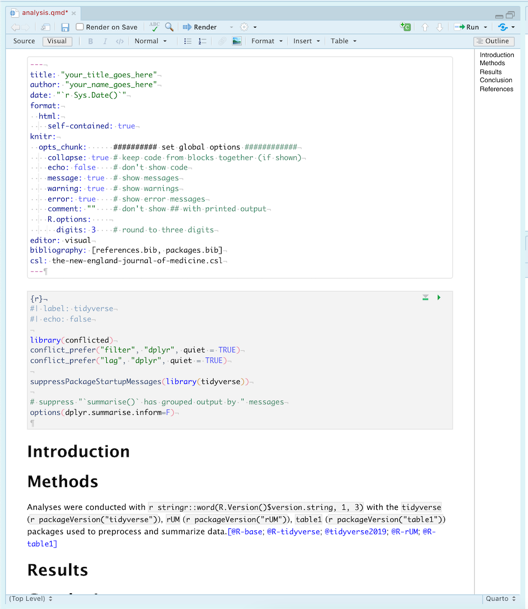

```{r, include = FALSE}
knitr::opts_chunk$set(
  collapse = TRUE,
  comment = "#>",
  fig.width = 6,
  fig.height = 4
)

options(rmarkdown.html_vignette.check_title = FALSE)
```

```{css, echo=FALSE}
body > h1 > img {
  position: relative;
  bottom: -30px;
  border: 0px solid rgba(0, 0, 0, 0.1);
 }
```

## Introduction

This is a collection of document templates, available through R, from your friends at the University of Miami (UM). $R+UM=rUM$

The `rUM` package will help you create research manuscripts by removing the configuration hassles commonly encountered when learning to write papers using R. `rUM` will initialize a new RStudio project and a Quarto file that includes the outline for a research paper. The Quarto file comes preconfigured with a YAML header (don't worry if you don't know what that means yet) with code chunks to load the `tidyverse` and `conflicted` packages. Manuscript sections have been created for Introduction, Methods, Results, Conclusion, and References. The project also includes a `.gitignore` file which is designed to help protect against accidentally leaking data when using git with websites like [www.github.com](https://github.com/).

rUM's documentation can be found here:

-   <https://raymondbalise.github.io/rUM/>
-   <https://github.com/RaymondBalise/rUM>

## How do I get `quarto` and `rUM`? (Add a "quart o' `rUM`"!)

1.  Modern version RStudio (v2022.07 or later) ships with Quarto but you can install the latest version of Quarto from [here](https://quarto.org/docs/get-started/).

2.  Add `rUM` to your computer by:

    -   using RStudio: click on the Packages tab in the bottom right windowpane, click the Install button, type ***rUM***, and click Install.
    -   downloading rUM from CRAN and installing it by running this code in R console:

    ``` r
    install.packages("rUM")
    ```

    -   downloading the latest version of rUM from GitHub by running commands into the R console:

    ``` r
    if (!requireNamespace("remotes")) install.packages("remotes")
    remotes::install_github("RaymondBalise/rUM")
    ```

3.  Use `rUM` by running this in the console of RStudio:

``` r
library(rUM)
```

## Ordering `rUM` from the Menu

To create a research project that uses `rUM`, follow these steps. This will initialize a new RStudio project that has an [`analysis.qmd`](#fig:analysis_quarto_file) Quarto file using the `tidyverse` and `conflicted` packages and some other useful files which are described [below](#stuff).

1.  Using the RStudio menus, choose: File \> New Project \> New Directory

2.  Scroll down and then select **`rUM` Research Project Template**

    {width="70%"}

3.  Specify the location of where your research project will be saved

    {width="70%"}

## Add `rUM` into an existing folder/directory that does not have an RStudio project.

What if you have already created a folder containing the important files for your project? Create a new project in your existing folder! This will now be your project directory (complete with a `.Rproj` file).

1.  Navigate to File \> New Project \> Existing Directory

2.  Specify the location of where your research project will be saved

    {width="70%"}

3.  Run the following script in your console:

``` r
# Change the text inside the quotes on the next line to indicate the path to your folder/directory.
PATH <- "~/Documents/blah"   

make_project(PATH, type = "Quarto (analysis.qmd)")
```

## What is in the project? (What is served with your `rUM`?) {#stuff}

A new project directory is created and it will be populated with [these files](#fig:created_rUM_files):

-   An aggressive `.gitignore` to help prevent the unintended sharing of sensitive study information or protected health information (PHI).
-   [`analysis.qmd`](#fig:analysis_quarto_file) is a Quarto template for writing your research project. It has a preconfigured YAML header; Introduction, Methods, Results, Conclusion, and Reference sections; and a code chunk to construct your bibliography using `knitr::write_bib()`.
-   An empty folder named `data`. This folder is listed within the `.gitignore`. That means that git should not track these files. This should help prevent data leakage but be sure to talk to a data security expert before sharing any biomedical projects on websites like GitHub.
-   A `.Rproj` file with the same name as your project folder.
-   Two text files, `packages.bib` and `references.bib`, which are used to hold details for your paper's bibliography. Refer to the Methods and References sections, respectively, within the [`analysis.qmd`](#fig:analysis_quarto_file) file for initial examples of how to add/use references.
-   [`the-new-england-journal-of-medicine.csl`](https://catalyst.nejm.org/pb-assets/images/NEJM%20Catalyst%20Reference%20style-1589400257323.pdf) is the citation style language (CSL) based on the [New England Journal of Medicine](https://catalyst.nejm.org/pb-assets/images/NEJM%20Catalyst%20Reference%20style-1589400257323.pdf) requirements.

Newly created files:

```{=html}
<br>
<p id="fig:created_rUM_files" >
</p>
```
{width="80%"}

`analysis.qmd`:

```{=html}
<br>
<p id="fig:analysis_quarto_file" >
</p>
```
{width="80%"}

### Session

If you are new to R, ignore this.

```{r}
sessionInfo()
```
