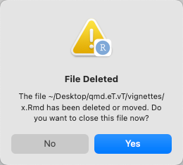

```{r, include = FALSE}
knitr::opts_chunk$set(
  collapse = TRUE,
  comment = "#>"
)
```

```{r setup, echo=FALSE}
library(rUM)
```

## Introduction
Saving your data and analyses into an R package helps to create reproducible research.  Someone who wants to reproduce your work can load a package to have access to your data and your paper(s).  **`rUM`** can help you by creating a project that has all the files/directories needed for an R package including a vignette folder that contains the outline of a paper.

## How do I make a package project?
All you need to do is add `vignette = TRUE` when you use the `make_project()` function. Once the project is created, run the **run_me.R** file.  For example type:

1. `rUM::make_project("~/Desktop/my.example", "R", example=TRUE, vignette=TRUE)`.  This creates a new project with all the files for a package in the current directory.  The vignette includes an example table and figure and all the R Markdown syntax for adding hyperlinks to the table and figures.
2. After the new project is open, run the **read_me.R** file. The easiest way to do this is by typing `source(run_me.R)` into the RStudio IDE console and then pressing enter. If you are working in RStudio it will ask you if it can/should close windows for two deleted files.  Say **Yes**. They are a couple temporary files that we used to set options the project.

<center>
{width="50%"}
</center>

3. Set the license for your package.  If you are not planning on publicly sharing your data we recommend using a proprietary license.  For example, type `usethis::use_proprietary_license("Your Name Goes Here")`.  To learn more about licences look at the documentation for `use_proprietary_license()` by typing: `?usethis::use_proprietary_license`.

## Can I write my vignette with Quarto?

Yes!  When you install **`rUM`** we make sure you have a modern version of the R `quarto` package but we do not install the most modern copy of the Quarto language itself (which lives outside of R).  You can make sure that your version of Quarto is modern enough by running `quarto::quarto_version()`.  If your version is not 1.4.549 or higher, install the latest version of Quarto directly from [here](https://quarto.org/docs/get-started/).