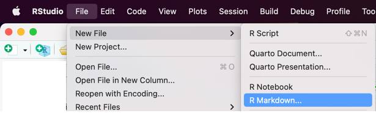
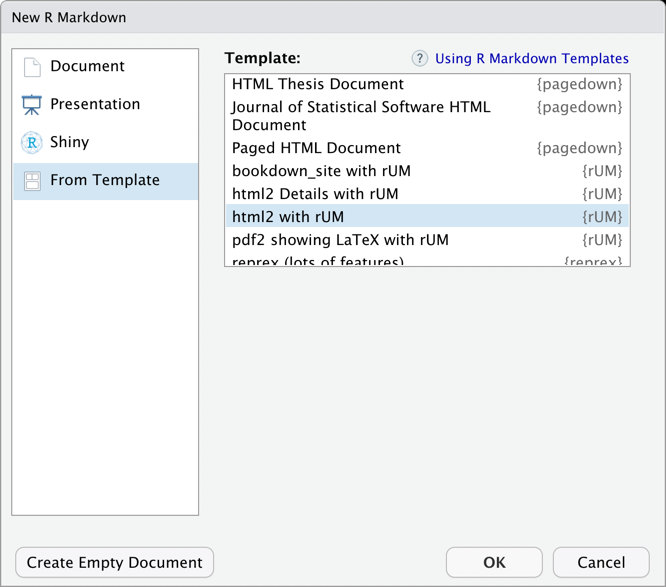

```{r, include = FALSE}
knitr::opts_chunk$set(
  collapse = TRUE,
  comment = "#>"
)
```

```{r setup, echo=FALSE}
library(rUM)
```

## Introduction

The `rUM` package installs several R Markdown document templates into the RStudio menus. These include a YAML header (where you can specify your name and the project name) and code chunks to enable the `tidyverse` package (to help with data processing), the `tidymodels` package (to help with modeling) and the `conflicted` package[^1].

[^1]: The `conflicted` package watches to make sure that you are not using a function that is defined twice. For example, the stats package, which ships with R has a function called `lag()` and if you load the `dplyr` package, which also contains a function called `lag()` it is not immediately obvious which version of the `lag()` function you will be using. `conflicted` will keep R from running the `lag()` function until you say which version you want to use. 

There is also a setup code chunk that sets options to:

-   show and hide code, messages and warnings
-   stop R from printing \## in the output
-   set number rounding to 3 decimal places

## Using Code Templates in RStudio

There are four templates:

1.  **html2 with rUM** : A basic web page
2.  **html2 Details with rUM**: A web page with more details
3.  **pdf2 showing LaTeX with rUM**: A pdf (with options to control tables' and figures' locations and appearances)
4.  **bookdown_site with rUM**: The structure of a book

You access the templates from the File menu by choosing

1.  New File \> R Markdown... 
2.  Choosing **From Template** from the windowpane on the left
3.  Scrolling down until you see the rUM templates 
4.  Click OK
