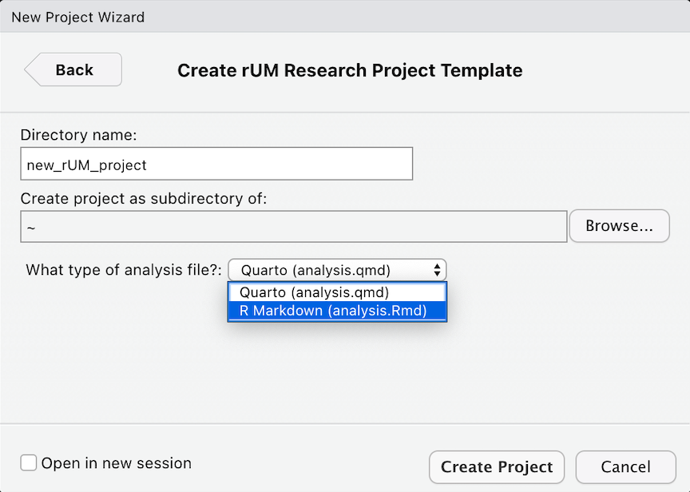
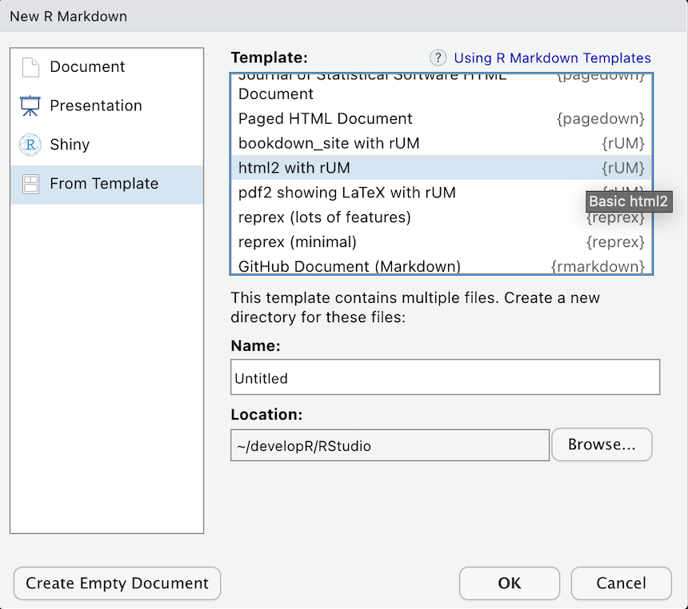

```{r, include = FALSE}
knitr::opts_chunk$set(
  collapse = TRUE,
  comment = "#>"
)
```


{width=25%}

## Introduction
This is collection of R things from your friends at UM (the University of Miami).

The `rUM` package will allow you to create powerful research manuscripts by taking the structure guesswork and configuration hassles out of the equation. `rUM` will create a new RStudio project and research boilerplate R Markdown file, complete with a YAML header requiring minimal customization. The R Markdown file also comes preconfigured with start up blocks that load the `tidyverse` and `conflicted` packages, and sections for Introduction, Method, Results, Conclusion, and References. Ensure the highest standards of data integrity by using the enhanced `.gitignore` file.

Future versions will add UM thesis and dissertation Markdown templates.


## How about `rUM` for your project?

1. Add your `rUM` by either: 

  * running this in the console of RStudio:

```r
if (!requireNamespace("remotes")) install.packages("remotes")
remotes::install_github("RaymondBalise/rUM")
```

  * going here: <https://raymondbalise.github.io/rUM/>   
  * or here:    <https://github.com/RaymondBalise/rUM> 

3. Get loaded on `rUM` by running this in the console of RStudio:

```r
library(rUM)
```


## Ordering `rUM` from the Menu

We would like to create a research project, so we use the `rUM` package. It creates a new RStudio project that has an analysis R markdown file using the `tidyverse` and `conflicted` packages. For more advanced analysis, we can also create R markdown files which use the `tidymodels` package.

1. Navigate to File > New Project > New Directory
1. Scroll down and then select **Research Project Template**

    {width=70%}

1. Specify the location of where your research project will be saved.

    {width=70%}
    

## Mixing `rUM` into an existing directory

What if you already have already created a folder containing important files for your project? Pretty easy... just create a new project in your existing folder! This will now be your project directory (with the `*.Rproj`). 

1. Navigate to File > New Project > Existing Directory
1. Specify the location of where your research project will be saved.

    {width=70%}
    
1. Run the following script in your console:

```
PATH <- "~/Documents/blah"   # change this to where you would like your project to be saved
make_project(PATH, type = "R Markdown (analysis.Rmd)")
```


## After your `rUM` has been served

A new project directory has been created and it will be populated with [these files](#fig:created_rUM_markdown_files):

* An aggressive `.gitignore` to prevent the unintended sharing of sensitive study information or protected health information (PHI).
* [`analysis.Rmd`](#fig:analysis_markdown) is a markdown boilerplate for writing your research project. It has a preconfigured YAML header; setup chunk; Introduction, Methods, Results, Conclusion, and Reference sections; and a code chunk to construct your bibliography using `knitr::write_bib()`.
* An empty folder named `data`. This folder is also listed in the `.gitignore` meaning that files stored in this folder are also safe from accidental disclosure.
* A `*.Rproj` with the same name as your project folder.
* `packages.bib` and `references.bib` to be filled as you progress in your research project writing (refer to the Methods and References sections, respectively, within the [`analysis.Rmd`](#fig:analysis_markdown) file for initial examples of how to use).
* `the-new-england-journal-of-medicine.csl` is the citation style language (CSL) based on the [New England Journal of Medicine](https://catalyst.nejm.org/pb-assets/images/NEJM%20Catalyst%20Reference%20style-1589400257323.pdf) recommendations and best practices. 
 

Newly created files:
```{=html}
<br>
<p id="fig:created_rUM_markdown_files" >
</p>
```    
{width=70%}
  
`analysis.Rmd`:

```{=html}
<br>
<p id="fig:analysis_markdown" >
</p>
``` 
{width=80%}


### Let the `rUM` soak in and ease your worries!


## `rUM` infused Markdown headers

1. Navigate to File > New File > RMarkdown

    {width=70%}

1. Select **From Template**

    {width=70%}

1. Choose a template:

* html2 with rUM
* html2 Details with rUM
* pdf2 showing LaTeX with rUM
* bookdown_site with rUM

This will create a new subdirectory in your current working directory with the same name as the name of the `.Rmd` file you specified. Within this directory, you will find the analysis RMarkdown file. For example, if you created an RMarkdown file called `wrangle_cytometry_data.Rmd` with the steps above, then your current directory will now have a subdirectory called `wrangle_cytometry_data/` which will contain the file `wrangle_cytometry_data.Rmd` and any subsequent files from the knitting process (such as `.PDF`, `.html`, or `.docx` files created by knitting the RMarkdown document).


### What are the headers

#### html2 with rUM
This is a basic web page

#### html2 Details with rUM
This is a basic web page with a table of contents

#### pdf2 showing LaTeX with rUM
PDF report where table and figures don’t float to other pages. Many thanks to <https://stackoverflow.com/questions/16626462/figure-position-in-markdown-when-converting-to-pdf-with-knitr-and-pandoc>.

#### bookdown_site with rUM
A bookdown website with a good table of contents for a book


### Session
If you are new to R, ignore this.
```{r}
sessionInfo()
```

