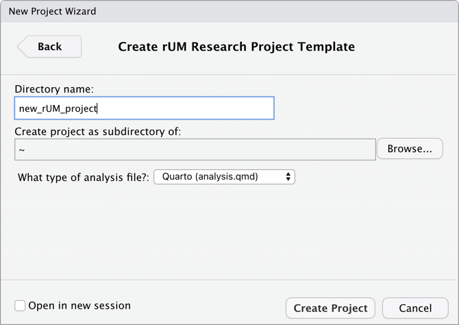
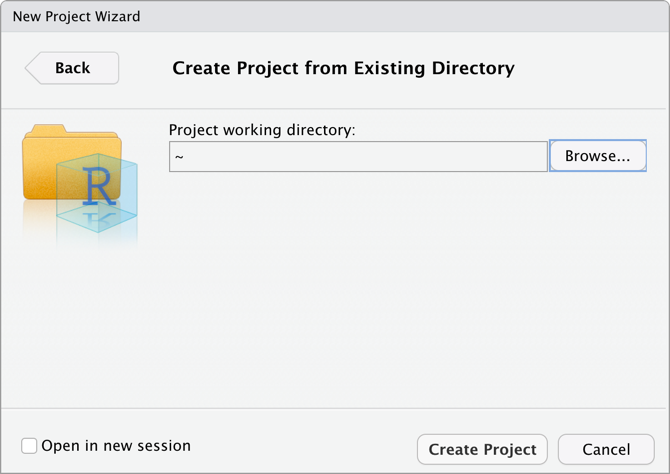

```{r, include = FALSE}
knitr::opts_chunk$set(
  collapse = TRUE,
  comment = "#>",
  fig.width=6, 
  fig.height=4
)

options(rmarkdown.html_vignette.check_title = FALSE)
```


{width=25%}

## Introduction
This is collection of R things from your friends at UM (the University of Miami).

The `rUM` package will allow you to create powerful research manuscripts by removing the structure guesswork and configuration hassles from the equation. `rUM` will initialize a new RStudio project and research boilerplate Quarto file, complete with a YAML header requiring minimal customization. The Quarto file comes preconfigured with code chunks to load the `tidyverse` and `conflicted` packages. Manuscript sections have been created for Introduction, Methods, Results, Conclusion, and References. Ensure the highest standards of data integrity by using the enhanced `.gitignore` file.

Future versions will add UM thesis and dissertation templates.


## How about a `quarto`' + '`rUM` (add a "quart o' `rUM`")?

1. First you need to install Quarto from [here](https://quarto.org/docs/get-started/).

2. Then add your `rUM` by either: 

  * running this in the console of RStudio:

```r
if (!requireNamespace("remotes")) install.packages("remotes")
remotes::install_github("RaymondBalise/rUM")
```

  * going here: <https://raymondbalise.github.io/rUM/>   
  * or here:    <https://github.com/RaymondBalise/rUM> 

3. Lastly, get loaded on `rUM` by running this in the console of RStudio:

```r
library(rUM)
```


## Ordering `rUM` from the Menu

To create a research project, follow these steps and use the `rUM` package. This will initialize a new RStudio project that has an [`analysis.qmd`](#fig:analysis_quarto_rUM) Quarto file using the `tidyverse` and `conflicted` packages. For more advanced analysis, we can also create Quarto files which use the `tidymodels` package.

1. Navigate to File > New Project > New Directory
1. Scroll down and then select **Research Project Template**

    {width=70%}

1. Specify the location of where your research project will be saved

    {width=70%}
    

## Mixing `rUM` into an existing directory

What if you already have already created a folder containing the important files for your project? Pretty easy... just create a new project in your existing folder! This will now be your project directory (with the `*.Rproj`). 

1. Navigate to File > New Project > Existing Directory
1. Specify the location of where your research project will be saved

    {width=70%}
    
1. Run the following script in your console:

```
PATH <- "~/Documents/blah"   # change this to where you would like your project to be saved
make_project(PATH, type = "Quarto (analysis.qmd)")
```


## After your `rUM` has been served

A new project directory has been created and it will be populated with [these files](#fig:created_rUM_files):

* An aggressive `.gitignore` to prevent the unintended sharing of sensitive study information or protected health information (PHI).
* [`analysis.qmd`](#fig:analysis_quarto_rUM) is a Quarto boilerplate for writing your research project. It has a preconfigured YAML header; setup code chunk; Introduction, Methods, Results, Conclusion, and Reference sections; and a code chunk to construct your bibliography using `knitr::write_bib()`.
* An empty folder named `data`. This folder is listed within the `.gitignore` meaning that files stored in this folder are safe from accidental disclosure via git-enabled file sharing services.
* A `*.Rproj` with the same name as your project folder.
* `packages.bib` and `references.bib` to be filled as you progress in your research project writing (refer to the Methods and References sections, respectively, within the [`analysis.qmd`](#fig:analysis_quarto_rUM) file for initial examples of how to use).
* [`the-new-england-journal-of-medicine.csl`](https://catalyst.nejm.org/pb-assets/images/NEJM%20Catalyst%20Reference%20style-1589400257323.pdf) is the citation style language (CSL) based on the [New England Journal of Medicine](https://catalyst.nejm.org/pb-assets/images/NEJM%20Catalyst%20Reference%20style-1589400257323.pdf) recommendations and best practices. 
 

Newly created files:
```{=html}
<br>
<p id="fig:created_rUM_files" >
</p>
```    
{width=80%}
  
`analysis.qmd`:

```{=html}
<br>
<p id="fig:analysis_quarto_rUM" >
</p>
``` 
{width=80%}


### Let the `rUM` soak in and ease your worries!
 


### Session
If you are new to R, ignore this.
```{r}
sessionInfo()
```

